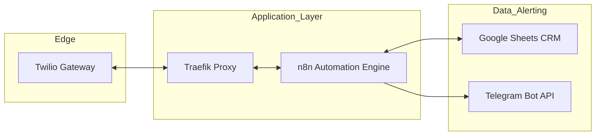
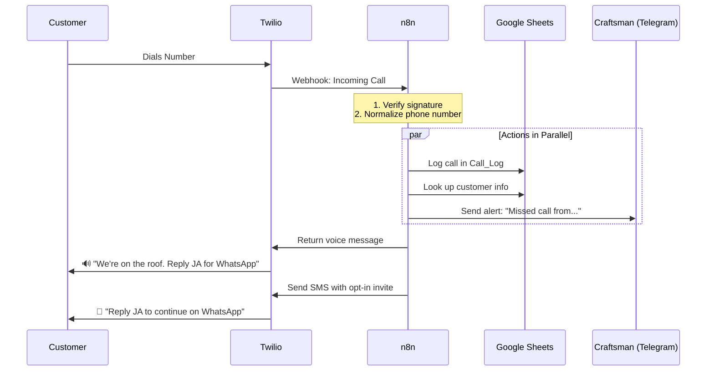
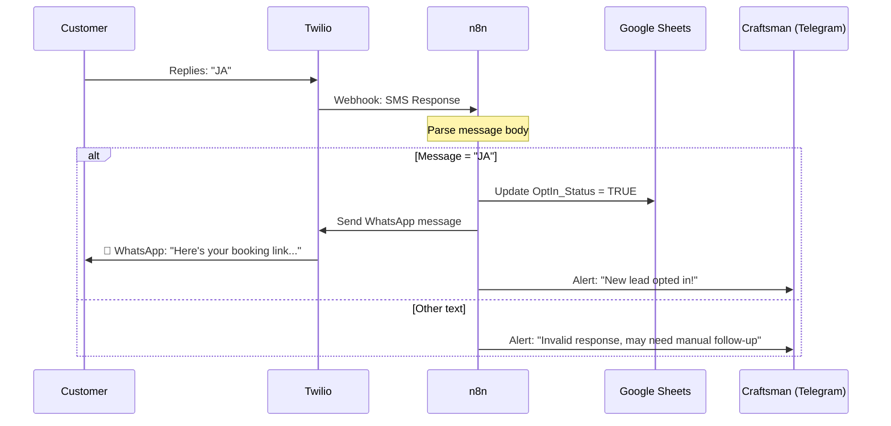

# Vorzimmerdrache: Systemarchitektur-Dokumentation

## Quick Start
**Funktion:** Verarbeitet automatisch verpasste Anrufe von Kunden, sendet eine Sprachnachricht, erfasst Informationen in einer Tabelle und leitet Kunden zur Nachverfolgung an WhatsApp weiter.

**Zielgruppe:** Handwerker (Dachdecker, Installateure etc.), die während der Arbeit keine Anrufe entgegennehmen können.

**Ablauf:** Kunde ruft an → hört „Wir sind auf dem Dach, antworte mit JA für WhatsApp“ → erhält SMS → antwortet mit „JA“ → erhält WhatsApp-Link mit Buchungsinfos → Handwerker sieht Benachrichtigung und kann nachfassen.

## 1. System Overview

### Infrastructure Layer
Das System läuft auf Docker hinter einem Traefik Reverse Proxy:



### Komponenten-Rollen
| Component | Role |
|-----------|------|
| **Twilio** | Empfängt Anrufe/SMS, sendet Sprachnachrichten und SMS |
| **n8n** | Orchestriert Workflows (Anrufbearbeitung, SMS-Verarbeitung, CRM-Updates) |
| **Google Sheets** | Speichert Kundendaten und Anrufhistorie |
| **Telegram** | Sendet Echtzeit-Alarme an den Handwerker |
| **Traefik** | Übernimmt SSL, Routing und Sicherheit |

## 2. Call Handling Flow

Wenn ein Kunde die Nummer des Handwerkers anruft:



**Customer Experience:**
1. Ruft die Nummer an.
2. Hört: „Moin! Wir sind gerade auf dem Dach...“
3. Erhält SMS: „Antworte mit JA, um über WhatsApp fortzufahren."

**Craftsman View:**
- Telegram-Benachrichtigung: „Verpasster Anruf von +49 171 1234567".
- Eintrag im Google Sheets Call_Log.

## 3. SMS Opt-In Flow

Nach Erhalt der SMS stimmt der Kunde zu:



**Customer Experience:**
1. Antwortet mit „JA" auf die SMS.
2. Erhält WhatsApp-Nachricht mit Buchungs-/Terminlink.
3. Kann nun direkt via WhatsApp mit dem Handwerker chatten.

**Craftsman View:**
- Telegram-Benachrichtigung: „Neuer Lead hat zugestimmt: +49 171 1234567".
- Customer OptIn_Status in Google Sheets aktualisiert.
- Kann nun auf WhatsApp antworten.

## 4. Multi-User Architecture

### Einzelner Handwerker (Aktuelle Implementierung)

**⚠️ Aktuelle Einschränkung:** Das System ist für EINEN Handwerker ausgelegt.

**Konfiguration pro Handwerker:**
- Eine Twilio-Telefonnummer.
- Eine Telegram Chat ID (empfängt alle Alarme).
- Ein Google Sheet (speichert alle Kunden).

**Um einen zweiten Handwerker hinzuzufügen, ist erforderlich:**
- Separate Twilio-Nummer.
- Separater Telegram-Bot/Chat.
- Separate n8n-Instanz ODER Routing-Logik nach:
  - Geografischem Gebiet (PLZ/Vorwahl).
  - Tageszeit (Geschäftszeiten pro Region).
  - Telefonnummer-Präfix.

### Mehrere Kunden ✅

**Funktionsweise:**
- Jeder Anrufer ist ein Kunde.
- Telefonnummer = Eindeutige Kennung.
- Google Sheets speichert unbegrenzt Kunden.
- Call_Log verfolgt alle Interaktionen pro Kunde.
- Wiederkehrende Kunden werden über Telefon-Lookup erkannt.

**Beispiel:**
```
Customer A: +49 171 1234567 (called 3x, opted-in)
Customer B: +49 160 9876543 (called 1x, not opted-in)
Customer C: +1 913 5550123 (called 2x, opted-in)
```

## 5. Data Model

### Google Sheets Struktur

**Sheet 1: Customers (Lead_DB)**
| Column | Description | Example |
|--------|-------------|---------|
| Phone | Primary key (E.164 format) | +491711234567 |
| Name | Kundenname | Hans Müller |
| OptIn_Status | Boolean (TRUE/FALSE) | TRUE |
| Last_Contact | Datum der letzten Interaktion | 2026-02-01 |

**Sheet 2: Call_Log**
| Column | Description | Example |
|--------|-------------|---------|
| Timestamp | Zeitpunkt des Anrufs | 2026-02-01 14:30:00 |
| Phone | Anrufernummer | +491711234567 |
| Status | Ergebnis des Anrufs | Missed / Opted-In |
| Action_Taken | Systemaktion | Sent SMS invite |

## 5. Technical Details

### Phone Number Normalization
Alle eingehenden Nummern werden in das E.164 Format konvertiert:
- **Input-Variationen:** `0171 1234567`, `0049 171 1234567`, `49 171 1234567`
- **Output:** `+491711234567`

### Security Measures
- **Webhook validation:** HMAC-SHA1 Signaturprüfung für alle Twilio-Anfragen.
- **Rate limiting:** 100 Anfragen/Minute via Traefik.
- **TLS only:** Gesamter Traffic wird über HTTPS erzwungen.
- **Credential storage:** API-Keys in `.env` (nie im Code).

### Error Handling
| Failure | Detection | Recovery |
|---------|-----------|----------|
| Webhook timeout | Twilio alert | Fallback auf statisches TwiML |
| Sheets API limit | n8n error (429) | Retry 3x mit exponential backoff |
| Database lock | SQLite error | WAL-Modus aktiviert |

## 6. Onboarding New Craftsmen

### Schritt-für-Schritt Einrichtung

**1. Google Sheets vorbereiten**
- Tabelle mit zwei Reitern erstellen: `Customers` und `Call_Log`.
- Header gemäß Sektion 4 hinzufügen.
- Mit Service-Account-E-Mail teilen.

**2. Twilio konfigurieren**
- Telefonnummer erwerben.
- Webhook-URLs setzen:
  - Voice: `https://your-domain.com/webhook/incoming-call`
  - SMS: `https://your-domain.com/webhook/sms-response`

**3. n8n Workflow einrichten**
- Template-Workflow duplizieren.
- Umgebungsvariablen aktualisieren:
  ```bash
  CRAFTSMAN_NAME="Max Mustermann"
  CRAFTSMAN_PHONE="+491711234567"
  TELEGRAM_CHAT_ID="123456789"
  SPREADSHEET_ID="your-sheet-id"
  TWILIO_ACCOUNT_SID="ACxxxxx"
  TWILIO_AUTH_TOKEN="your-token"
  ```

**4. Telegram konfigurieren**
- Chat mit dem Bot starten.
- Chat-ID via `/start` Befehl abrufen.
- In `.env` als `TELEGRAM_CHAT_ID` eintragen.

**5. Test Flow**
- Twilio-Nummer anrufen.
- Telegram-Alarm prüfen.
- Google Sheets Log-Eintrag prüfen.
- Mit „JA" auf SMS antworten.
- WhatsApp-Zustellung prüfen.

## 7. Daily Operations

### Für den Handwerker

**Passives Monitoring:**
- Erhalt von Telegram-Alarmen für:
  - Jeden verpassten Anruf mit Telefonnummer.
  - Jeden erfolgreichen Opt-In.

**Aktive Nachverfolgung:**
- WhatsApp öffnen, um Kunden mit Opt-In zu kontaktieren.
- Google Sheets prüfen, um Anrufhistorie einzusehen.
- Keine manuelle Dateneingabe erforderlich – alles erfolgt automatisch.

### Für den Administrator

**Monitoring:**
- n8n Dashboard auf Workflow-Fehler prüfen.
- Monatlicher Abgleich Call_Log gegen Twilio-Abrechnung.

**Wartung:**
- `.env` bei Konfigurationsänderungen anpassen.
- Container neu starten: `docker-compose restart`

## 8. Technology Stack

| Component | Technology | Purpose |
|-----------|-----------|---------|
| Orchestration | n8n v1.50.0 | Workflow-Automatisierung |
| Communication | Twilio API | Voice, SMS, WhatsApp |
| Proxy | Traefik v2.11 | SSL, Routing, Rate Limiting |
| Database | SQLite (WAL) | Interner n8n-Status |
| CRM | Google Sheets API | Kundendaten, Logs |
| Notifications | Telegram Bot | Echtzeit-Alarme |
| Deployment | Docker Compose | Container-Orchestrierung |