# Vorzimmerdrache: Systemarchitektur-Dokumentation

## Quick Start
**Funktion:** Verarbeitet automatisch verpasste Anrufe von Kunden, sendet eine Sprachnachricht, erfasst Informationen in einer Tabelle und leitet Kunden zur Nachverfolgung an WhatsApp weiter.

**Zielgruppe:** Handwerker (Dachdecker, Installateure etc.), die während der Arbeit keine Anrufe entgegennehmen können.

**Ablauf:** Kunde ruft an → hört „Wir sind auf dem Dach, antworte mit JA für WhatsApp“ → erhält SMS → antwortet mit „JA“ → erhält WhatsApp-Link mit Buchungsinfos → Handwerker sieht Benachrichtigung und kann nachfassen.

## 1. System Overview

### High-Level Architecture


### Network & Container Topology


### Infrastructure Layer
Das System läuft auf Docker hinter einem Traefik Reverse Proxy:


### Komponenten-Rollen
| Component | Role |
|-----------|------|
| **Twilio** | Empfängt Anrufe/SMS, sendet Sprachnachrichten und SMS |
| **n8n** | Orchestriert Workflows (Anrufbearbeitung, SMS-Verarbeitung, CRM-Updates) |
| **Google Sheets** | Speichert Kundendaten und Anrufhistorie |
| **Telegram** | Sendet Echtzeit-Alarme an den Handwerker |
| **Traefik** | Übernimmt SSL, Routing und Sicherheit |

## 2. Lead Lifecycle State Machine


### Lead States Explained

| State | Description | Next Action |
|-------|-------------|-------------|
| **IncomingCall** | Customer is calling | System answers, logs call |
| **Logged** | Call recorded in Google Sheets | SMS opt-in invite sent |
| **SMS_Sent** | Opt-in SMS delivered | Waiting for customer reply |
| **PendingOptIn** | 24-hour window active | Customer replies or expires |
| **WhatsApp_Active** | Opt-in confirmed | Send WhatsApp link |
| **Expired** | No response within 24h | Manual follow-up needed |
| **ManualFollowUp** | Craftsman takes over | Conversation via WhatsApp |

## 3. Data Flow: CRM Updates


### CRM Update Flow Details

**Phone Normalization:**
- **Input:** `0171 1234567`, `0049 171 1234567`, `+49 171 1234567`
- **Validation:** Regex `^\+?[1-9]\d{1,14}$`
- **Output:** `+491711234567` (E.164 format)

**Google Sheets Operations:**
1. **Lookup:** Query by `Phone` column
2. **Update:** Modify `Last_Contact` timestamp
3. **Log:** Append row to `Call_Log` sheet

**Parallel Processing:**
- Voice message (instant response)
- SMS delivery (async)
- Telegram alert (async, non-blocking)

## 4. Call Handling Flow

Wenn ein Kunde die Nummer des Handwerkers anruft:


**Customer Experience:**
1. Ruft die Nummer an.
2. Hört: „Moin! Wir sind gerade auf dem Dach...“
3. Erhält SMS: „Antworte mit JA, um über WhatsApp fortzufahren."

**Craftsman View:**
- Telegram-Benachrichtigung: „Verpasster Anruf von +49 171 1234567".
- Eintrag im Google Sheets Call_Log.

## 5. SMS Opt-In Flow

Nach Erhalt der SMS stimmt der Kunde zu:

```mermaid
sequenceDiagram
    participant C as Customer
    participant T as Twilio
    participant N as n8n
    participant G as Google Sheets
    participant H as Craftsman (Telegram)

    C->>T: Replies: "JA"
    T->>N: Webhook: SMS Response
    
    Note over N: Parse message body
    
    alt Message = "JA"
        N->>G: Update OptIn_Status = TRUE
        N->>T: Send WhatsApp message
        T->>C: 📲 WhatsApp: "Here's your booking link..."
        N->>H: Alert: "New lead opted in!"
    else Other text
        N->>H: Alert: "Invalid response, may need manual follow-up"
    end
```



**Customer Experience:**
1. Antwortet mit „JA" auf die SMS.
2. Erhält WhatsApp-Nachricht mit Buchungs-/Terminlink.
3. Kann nun direkt via WhatsApp mit dem Handwerker chatten.

**Craftsman View:**
- Telegram-Benachrichtigung: „Neuer Lead hat zugestimmt: +49 171 1234567".
- Customer OptIn_Status in Google Sheets aktualisiert.
- Kann nun auf WhatsApp antworten.

## 6. Error Handling & Recovery Flows

### Error Matrix

| Twilio Error Code | Description | Recovery Action | Notification |
|-------------------|-------------|-----------------|--------------|
| **21614** | "To" number is not a valid mobile number | Skip SMS, send Telegram alert | Landline detected |
| **21612** | Phone number is not reachable | Retry 3x with backoff | Delivery failed |
| **21408** | Permission to send SMS not enabled | Check Twilio account permissions | Configuration error |
| **30001** | Queue overflow | Retry after 1s delay | Rate limit hit |

### Error Handling Flow


### Webhook Security Implementation

**HMAC-SHA1 Signature Verification:**
```javascript
// n8n Function Node code
const crypto = require('crypto');
const url = require('url');

const twilioSignature = $webhook.headers['x-twilio-signature'];
const urlParsed = url.parse($webhook.url);
const urlWithPath = $execution.url.split('?')[0];

const signature = crypto
  .createHmac('sha1', $env.TWILIO_AUTH_TOKEN)
  .update(urlWithPath + $webhook.body)
  .digest('base64');

if (signature !== twilioSignature) {
  throw new Error('Invalid Twilio signature');
}

// Valid, continue processing
```

### Common Failure Scenarios

**1. Landline Detection:**
- **Trigger:** Twilio Lookup API returns "landline"
- **Action:** Skip SMS, send Telegram alert immediately
- **Message:** "📞 Landline call from +49 XXX XXXXXXX - SMS not possible, please call back"

**2. Twilio Balance Low:**
- **Trigger:** Balance < €5.00
- **Action:** Alert via Telegram
- **Monitoring:** n8n sub-workflow checks hourly

**3. SQLite Database Lock:**
- **Symptom:** `SQLITE_BUSY` error
- **Recovery:** 
  ```bash
  # Check for lock files
  ls -la n8n_data/.n8n/*.journal
  ls -la n8n_data/.n8n/*-wal
  
  # Restart n8n container
  docker compose restart n8n
  ```
- **Prevention:** WAL mode enabled, max 1 concurrent write

## 7. Multi-User Architecture

### Einzelner Handwerker (Aktuelle Implementierung)

**⚠️ Aktuelle Einschränkung:** Das System ist für EINEN Handwerker ausgelegt.

**Konfiguration pro Handwerker:**
- Eine Twilio-Telefonnummer.
- Eine Telegram Chat ID (empfängt alle Alarme).
- Ein Google Sheet (speichert alle Kunden).

**Um einen zweiten Handwerker hinzuzufügen, ist erforderlich:**
- Separate Twilio-Nummer.
- Separater Telegram-Bot/Chat.
- Separate n8n-Instanz ODER Routing-Logik nach:
  - Geografischem Gebiet (PLZ/Vorwahl).
  - Tageszeit (Geschäftszeiten pro Region).
  - Telefonnummer-Präfix.

### Zweiten Handwerker hinzufügen

**Option A: Separate Instanz (Empfohlen)**
```bash
# Neue Server-Instanz aufsetzen
git clone <repo> vorzimmerdrache-craftsman2
cd vorzimmerdrache-craftsman2

# Neue .env mit anderen Credentials
cp .env.example .env
nano .env
# Anpassen:
# - DOMAIN: craftsman2.example.com
# - CRAFTSMAN_NAME: "Max Mustermann"
# - TELEGRAM_CHAT_ID: <andere Chat ID>
# - TWILIO_PHONE_NUMBER: <andere Twilio-Nummer>
# - GOOGLE_SHEETS_SPREADSHEET_ID: <anderes Sheet>

# Deployen
./scripts/deploy-1gb.sh
```

**Option B: Gemeinsame Instanz mit Routing (Komplex)**
- Erfordert Anpassung der Workflows
- Routing-Logik basierend auf:
  - Anrufer-Region (Vorwahl)
  - Tageszeit
  - Tag der Woche

**Empfehlung:** Für 1-2 Handwerker → Separate Instanzen. Für 10+ Handwerker → Routing-Logik implementieren.

### Mehrere Kunden ✅

**Funktionsweise:**
- Jeder Anrufer ist ein Kunde.
- Telefonnummer = Eindeutige Kennung.
- Google Sheets speichert unbegrenzt Kunden.
- Call_Log verfolgt alle Interaktionen pro Kunde.
- Wiederkehrende Kunden werden über Telefon-Lookup erkannt.

**Beispiel:**
```
Customer A: +49 171 1234567 (called 3x, opted-in)
Customer B: +49 160 9876543 (called 1x, not opted-in)
Customer C: +1 913 5550123 (called 2x, opted-in)
```

## 9. WhatsApp Template Constraints

### 24-Hour Window Rule

Twilio Business API enforces strict messaging rules:

**Within 24 hours:**
- Free-form messages allowed after customer opt-in
- Direct conversation possible

**After 24 hours:**
- Only pre-approved templates allowed
- No free-form text permitted

**Template Structure:**
```
Template Name: booking_link_v1
Content: "Hi {{1}}, thanks for your interest! 
Here's your booking link: {{2}}
Reply STOP to opt out."
Variables:
  {{1}} = Customer Name
  {{2}} = Booking URL
```

**Template Approval Process:**
1. Create template in Twilio Console
2. Submit for WhatsApp approval
3. Wait 24-48 hours for review
4. Use `TWILIO_WHATSAPP_TEMPLATE_SID` in n8n

### WhatsApp Link Format

**Pre-filled Message Format:**
```
https://wa.me/491711234567?text=Hi%2C%20I%20received%20your%20booking%20link
```

**Components:**
- Base: `https://wa.me/`
- Number: `491711234567` (E.164 without +)
- Query: `?text=` + URL-encoded message

## 10. Data Model

### Google Sheets Struktur

**Sheet 1: Customers (Lead_DB)**
| Column | Description | Example |
|--------|-------------|---------|
| Phone | Primary key (E.164 format) | +491711234567 |
| Name | Kundenname | Hans Müller |
| OptIn_Status | Boolean (TRUE/FALSE) | TRUE |
| Last_Contact | Datum der letzten Interaktion | 2026-02-01 |

**Sheet 2: Call_Log**
| Column | Description | Example |
|--------|-------------|---------|
| Timestamp | Zeitpunkt des Anrufs | 2026-02-01 14:30:00 |
| Phone | Anrufernummer | +491711234567 |
| Status | Ergebnis des Anrufs | Missed / Opted-In |
| Action_Taken | Systemaktion | Sent SMS invite |

## 11. Technical Details

### Phone Number Normalization
Alle eingehenden Nummern werden in das E.164 Format konvertiert:
- **Input-Variationen:** `0171 1234567`, `0049 171 1234567`, `49 171 1234567`
- **Output:** `+491711234567`

### Security Measures
- **Webhook validation:** HMAC-SHA1 Signaturprüfung für alle Twilio-Anfragen.
- **Rate limiting:** 100 Anfragen/Minute via Traefik.
- **TLS only:** Gesamter Traffic wird über HTTPS erzwungen.
- **Credential storage:** API-Keys in `.env` (nie im Code).

### Error Handling
| Failure | Detection | Recovery |
|---------|-----------|----------|
| Webhook timeout | Twilio alert | Fallback auf statisches TwiML |
| Sheets API limit | n8n error (429) | Retry 3x mit exponential backoff |
| Database lock | SQLite error | WAL-Modus aktiviert |

## 12. Onboarding New Craftsmen

### Schritt-für-Schritt Einrichtung

**1. Google Sheets vorbereiten**
- Tabelle mit zwei Reitern erstellen: `Customers` und `Call_Log`.
- Header gemäß Sektion 4 hinzufügen.
- Mit Service-Account-E-Mail teilen.

**2. Twilio konfigurieren**
- Telefonnummer erwerben.
- Webhook-URLs setzen:
  - Voice: `https://your-domain.com/webhook/incoming-call`
  - SMS: `https://your-domain.com/webhook/sms-response`

**3. n8n Workflow einrichten**
- Template-Workflow duplizieren.
- Umgebungsvariablen aktualisieren:
  ```bash
  CRAFTSMAN_NAME="Max Mustermann"
  CRAFTSMAN_PHONE="+491711234567"
  TELEGRAM_CHAT_ID="123456789"
  SPREADSHEET_ID="your-sheet-id"
  TWILIO_ACCOUNT_SID="ACxxxxx"
  TWILIO_AUTH_TOKEN="your-token"
  ```

**4. Telegram konfigurieren**
- Chat mit dem Bot starten.
- Chat-ID via `/start` Befehl abrufen.
- In `.env` als `TELEGRAM_CHAT_ID` eintragen.

**5. Test Flow**
- Twilio-Nummer anrufen.
- Telegram-Alarm prüfen.
- Google Sheets Log-Eintrag prüfen.
- Mit „JA" auf SMS antworten.
- WhatsApp-Zustellung prüfen.

### Multi-Craftsman Routing (Future Architecture)


**Routing Logic (Future Implementation):**

| Routing Method | Description | Complexity |
|----------------|-------------|------------|
| **Geographic** | Area code → Regional craftsman | Medium |
| **Time-based** | Business hours → Local, Off-hours → On-call | High |
| **Load balancing** | Round-robin across available craftsmen | Low |
| **Skill-based** | Project type → Specialist craftsman | Very High |

## 8. Daily Operations

### Für den Handwerker

**Passives Monitoring:**
- Erhalt von Telegram-Alarmen für:
  - Jeden verpassten Anruf mit Telefonnummer.
  - Jeden erfolgreichen Opt-In.

**Aktive Nachverfolgung:**
- WhatsApp öffnen, um Kunden mit Opt-In zu kontaktieren.
- Google Sheets prüfen, um Anrufhistorie einzusehen.
- Keine manuelle Dateneingabe erforderlich – alles erfolgt automatisch.

### Für den Administrator

**Monitoring:**
- n8n Dashboard auf Workflow-Fehler prüfen.
- Monatlicher Abgleich Call_Log gegen Twilio-Abrechnung.

**Wartung:**
- `.env` bei Konfigurationsänderungen anpassen.
- Container neu starten: `docker-compose restart`

## 13. Technology Stack

| Component | Technology | Purpose |
|-----------|-----------|---------|
| Orchestration | n8n v1.50.0 | Workflow-Automatisierung |
| Communication | Twilio API | Voice, SMS, WhatsApp |
| Proxy | Traefik v2.11 | SSL, Routing, Rate Limiting |
| Database | SQLite (WAL) | Interner n8n-Status |
| CRM | Google Sheets API | Kundendaten, Logs |
| Notifications | Telegram Bot | Echtzeit-Alarme |
| Deployment | Docker Compose | Container-Orchestrierung |