# Vorzimmerdrache: System Architecture Documentation

## Quick Start
**What it does:** Automatically handles missed calls from customers, sends a voice message, captures their info in a spreadsheet, and moves them to WhatsApp for follow-up.

**Who it's for:** Craftsmen (roofers, plumbers, etc.) who can't answer their phone while working.

**What happens:** A customer calls → hears "We're on the roof, reply JA for WhatsApp" → gets SMS → replies "JA" → receives WhatsApp link with booking info → craftsman sees notification and can follow up.

## 1. System Overview

### Infrastructure Layer
The system runs on Docker behind Traefik reverse proxy:


### What Each Component Does
| Component | Role |
|-----------|------|
| **Twilio** | Receives calls/SMS, sends voice messages and SMS |
| **n8n** | Orchestrates workflows (call handling, SMS processing, CRM updates) |
| **Google Sheets** | Stores customer data and call history |
| **Telegram** | Sends real-time alerts to the craftsman |
| **Traefik** | Handles SSL, routing, and security |

## 2. Call Handling Flow

When a customer calls the craftsman's number:


**What the customer experiences:**
1. Calls the number
2. Hears: "Moin! We're on the roof right now..."
3. Receives SMS: "Reply JA to continue on WhatsApp"

**What the craftsman sees:**
- Telegram notification: "Missed call from +49 171 1234567"
- Entry in Google Sheets Call_Log

## 3. SMS Opt-In Flow

After receiving the SMS, the customer opts in:

```mermaid
sequenceDiagram
    participant C as Customer
    participant T as Twilio
    participant N as n8n
    participant G as Google Sheets
    participant H as Craftsman (Telegram)

    C->>T: Replies: "JA"
    T->>N: Webhook: SMS Response
    
    Note over N: Parse message body
    
    alt Message = "JA"
        N->>G: Update OptIn_Status = TRUE
        N->>T: Send WhatsApp message
        T->>C: 📲 WhatsApp: "Here's your booking link..."
        N->>H: Alert: "New lead opted in!"
    else Other text
        N->>H: Alert: "Invalid response, may need manual follow-up"
    end
```



**What the customer experiences:**
1. Replies "JA" to SMS
2. Receives WhatsApp message with booking/appointment link
3. Can now chat with the craftsman on WhatsApp

**What the craftsman sees:**
- Telegram notification: "New lead opted in: +49 171 1234567"
- Customer's OptIn_Status updated in Google Sheets
- Can now respond to customer on WhatsApp

## 4. Multi-User Architecture

### Single Craftsman (Current Implementation)

**⚠️ Current Limitation:** The system is designed for ONE craftsman.

**Configuration per craftsman:**
- One Twilio phone number
- One Telegram Chat ID (receives all alerts)
- One Google Sheet (stores all customers)

**To add a second craftsman, you need:**
- Separate Twilio number
- Separate Telegram bot/chat
- Separate n8n instance OR routing logic by:
  - Geographic area (ZIP code/area code)
  - Time of day (business hours per region)
  - Phone number prefix

### Multiple Customers ✅

**How it works:**
- Every caller is a customer
- Phone number = unique identifier
- Google Sheets stores unlimited customers
- Call_Log tracks all interactions per customer
- Returning customers recognized by phone lookup

**Example:**
```
Customer A: +49 171 1234567 (called 3x, opted-in)
Customer B: +49 160 9876543 (called 1x, not opted-in)
Customer C: +1 913 5550123 (called 2x, opted-in)
```

## 5. Data Model

### Google Sheets Structure

**Sheet 1: Customers (Lead_DB)**
| Column | Description | Example |
|--------|-------------|---------|
| Phone | Primary key (E.164 format) | +491711234567 |
| Name | Customer name | Hans Müller |
| OptIn_Status | Boolean (TRUE/FALSE) | TRUE |
| Last_Contact | Date of last interaction | 2026-02-01 |

**Sheet 2: Call_Log**
| Column | Description | Example |
|--------|-------------|---------|
| Timestamp | When call occurred | 2026-02-01 14:30:00 |
| Phone | Caller number | +491711234567 |
| Status | Call outcome | Missed / Opted-In |
| Action_Taken | What system did | Sent SMS invite |

## 5. Technical Details

### Phone Number Normalization
All incoming numbers are converted to E.164 format:
- **Input variations:** `0171 1234567`, `0049 171 1234567`, `49 171 1234567`
- **Output:** `+491711234567`

### Security Measures
- **Webhook validation:** HMAC-SHA1 signature check on all Twilio requests
- **Rate limiting:** 100 requests/minute via Traefik
- **TLS only:** All traffic forced over HTTPS
- **Credential storage:** API keys in `.env` (never in code)

### Error Handling
| Failure | Detection | Recovery |
|---------|-----------|----------|
| Webhook timeout | Twilio alert | Fallback to static TwiML |
| Sheets API limit | n8n error (429) | Retry 3x with exponential backoff |
| Database lock | SQLite error | WAL mode enabled |

## 6. Onboarding New Craftsmen

### Step-by-Step Setup

**1. Prepare Google Sheets**
- Create spreadsheet with two sheets: `Customers` and `Call_Log`
- Add headers as shown in Section 4
- Share with service account email

**2. Configure Twilio**
- Purchase phone number
- Set webhook URLs:
  - Voice: `https://your-domain.com/webhook/incoming-call`
  - SMS: `https://your-domain.com/webhook/sms-response`

**3. Set up n8n Workflow**
- Duplicate the template workflow
- Update environment variables:
  ```bash
  CRAFTSMAN_NAME="Max Mustermann"
  CRAFTSMAN_PHONE="+491711234567"
  TELEGRAM_CHAT_ID="123456789"
  SPREADSHEET_ID="your-sheet-id"
  TWILIO_ACCOUNT_SID="ACxxxxx"
  TWILIO_AUTH_TOKEN="your-token"
  ```

**4. Configure Telegram**
- Start chat with your bot
- Get chat ID via `/start` command
- Add to `.env` as `TELEGRAM_CHAT_ID`

**5. Test Flow**
- Call the Twilio number
- Verify you receive Telegram alert
- Check Google Sheets for log entry
- Reply "JA" to SMS
- Verify WhatsApp message arrives

## 7. Daily Operations

### For the Craftsman

**Passive Monitoring:**
- You'll receive Telegram alerts for:
  - Every missed call with phone number
  - Every successful opt-in

**Active Follow-up:**
- Open WhatsApp to message customers who opted in
- Check Google Sheets to see call history
- No need to manually enter data - it's all automatic

### For the Administrator

**Monitoring:**
- Check n8n dashboard for workflow failures
- Review Call_Log monthly against Twilio billing

**Maintenance:**
- Update `.env` for configuration changes
- Restart containers: `docker-compose restart`

## 8. Technology Stack

| Component | Technology | Purpose |
|-----------|-----------|---------|
| Orchestration | n8n v1.50.0 | Workflow automation |
| Communication | Twilio API | Voice, SMS, WhatsApp |
| Proxy | Traefik v2.11 | SSL, routing, rate limiting |
| Database | SQLite (WAL) | n8n internal state |
| CRM | Google Sheets API | Customer data, logs |
| Notifications | Telegram Bot | Real-time alerts |
| Deployment | Docker Compose | Container orchestration |
