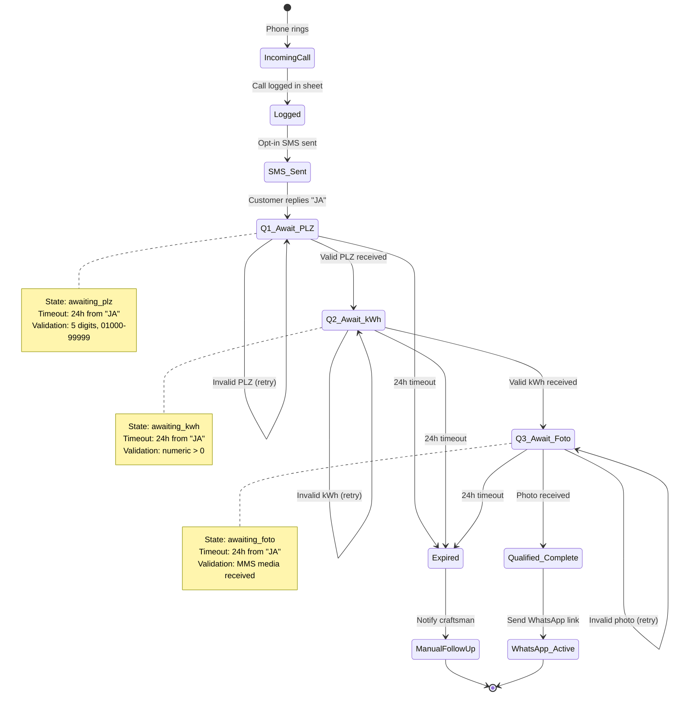

# SMS 3-Question Qualification Flow

## Overview

Converts the simple SMS "JA" → WhatsApp flow into a 3-step qualification process:
1. **PLZ** (postal code) - 5-digit German postal code
2. **kWh** (annual consumption) - numeric value > 0
3. **Foto** (meter cabinet photo) - Twilio MMS image

**Goal:** Collect qualification data before sending WhatsApp link to improve lead quality.

## State Machine

### Updated State Diagram



### State Transitions

| Current State | Input | Next State | Response |
|--------------|-------|------------|----------|
| `SMS_Sent` | "JA" | `Q1_Await_PLZ` | "Danke! Für ein Angebot brauchen wir 3 Infos: 1. Ihre PLZ?" |
| `Q1_Await_PLZ` | 5-digit PLZ | `Q2_Await_kWh` | "Danke! Noch 2 Fragen: 2. Jahresstromverbrauch (kWh)?" |
| `Q1_Await_PLZ` | Invalid | `Q1_Await_PLZ` | "Bitte eine 5-stellige PLZ (z.B. 12345)" |
| `Q2_Await_kWh` | Numeric kWh | `Q3_Await_Foto` | "Danke! Letzte Frage: 3. Foto vom Zählerschrank" |
| `Q2_Await_kWh` | Invalid | `Q2_Await_kWh` | "Bitte nur die Zahl (z.B. 3500)" |
| `Q3_Await_Foto` | MMS image | `Qualified_Complete` | "Perfekt! Hier ist Ihr WhatsApp-Link: [URL]" |
| `Q3_Await_Foto` | No media | `Q3_Await_Foto` | "Bitte ein Foto senden" |
| Any state | Timeout | `Expired` | (Silent, notify craftsman) |

## Google Sheets Schema

### New Columns (Customers Sheet)

| Column | Type | Description | Example |
|--------|------|-------------|---------|
| `conversation_state` | String | Current conversation state | `awaiting_plz`, `awaiting_kwh`, `awaiting_foto`, `qualified_complete` |
| `plz` | String | Postal code (5 digits) | `12345` |
| `kwh_consumption` | Number | Annual consumption in kWh | `3500` |
| `meter_photo_url` | String | Twilio MMS media URL | `https://media.twilio.com/...` |
| `qualification_timestamp` | DateTime | When all 3 answers collected | `2026-02-01 14:30:00` |
| `last_state_change` | DateTime | State transition timestamp | `2026-02-01 14:25:00` |

### Updated Sheet Structure

**Sheet 1: Customers (Lead_DB)**

| Phone | Name | OptIn_Status | conversation_state | plz | kwh_consumption | meter_photo_url | qualification_timestamp | last_state_change | Last_Contact |
|-------|------|--------------|-------------------|-----|-----------------|-----------------|------------------------|-------------------|--------------|
| +491711234567 | Hans M. | TRUE | awaiting_kwh | 12345 | | | | 2026-02-01 14:25 | 2026-02-01 |
| +491609876543 | Anna K. | TRUE | qualified_complete | 54321 | 3500 | https://... | 2026-02-01 15:00 | 2026-02-01 15:00 | 2026-02-01 |

**Sheet 2: Call_Log** (unchanged)

**Sheet 3: Conversation_History** (NEW)

| Timestamp | Phone | From_State | To_State | Message_Type | Content |
|-----------|-------|------------|----------|--------------|---------|
| 2026-02-01 14:00 | +491711234567 | SMS_Sent | Q1_Await_PLZ | system | "Danke! Für ein Angebot..." |
| 2026-02-01 14:05 | +491711234567 | Q1_Await_PLZ | Q2_Await_kWh | customer | "12345" |
| 2026-02-01 14:06 | +491711234567 | Q2_Await_kWh | Q3_Await_Foto | system | "Danke! Noch 2 Fragen..." |

## n8n Workflow Modifications

### New Workflow Structure

```mermaid
flowchart TD
    Start[Webhook Trigger] --> Validate[Validate Signature]
    Validate -->|Valid| Parse[Parse SMS/MMS]
    Validate -->|Invalid| Forbidden[403 Response]
    
    Parse --> LookupState{Lookup State in Sheets}
    
    LookupState -->|New / SMS_Sent| CheckJA{Is "JA"?}
    LookupState -->|awaiting_plz| ValidatePLZ{Validate PLZ}
    LookupState -->|awaiting_kwh| ValidatekWh{Validate kWh}
    LookupState -->|awaiting_foto| CheckMedia{Has MMS Media?}
    LookupState -->|qualified_complete| SendLink[Send WhatsApp Link]
    
    CheckJA -->|Yes| SetPLZ[Set state: awaiting_plz]
    CheckJA -->|No| Ack[Acknowledge]
    
    SetPLZ --> Q1Response[Send Q1 prompt]
    Q1Response --> UpdatePLZ[Update Sheets]
    
    ValidatePLZ -->|Valid 5-digit| SetkWh[Set state: awaiting_kwh]
    ValidatePLZ -->|Invalid| PLZError[Send error]
    
    SetkWh --> Q2Response[Send Q2 prompt]
    Q2Response --> UpdatekWh[Update Sheets + save PLZ]
    
    ValidatekWh -->|Valid numeric| SetFoto[Set state: awaiting_foto]
    ValidatekWh -->|Invalid| kWhError[Send error]
    
    SetFoto --> Q3Response[Send Q3 prompt]
    Q3Response --> UpdateState[Update Sheets + save kWh]
    
    CheckMedia -->|Yes image| Complete[Set state: qualified_complete]
    CheckMedia -->|No| FotoError[Send error]
    
    Complete --> SavePhoto[Save photo URL]
    SavePhoto --> UpdateComplete[Update Sheets timestamp]
    UpdateComplete --> SendLink
    
    SendLink --> Telegram[Alert craftsman]
    SendLink --> Response[Success response]
    
    PLZError --> UpdatePLZ
    kWhError --> UpdatekWh
    FotoError --> UpdateState
    
    Ack --> End[End]
    Response --> End
    Forbidden --> End
    End
```

### Key Node Changes

**1. Parse SMS/MMS Node (Code)**
```javascript
const body = $input.first().json.body || {};
const phone = body.From || '';
const messageBody = body.Body || '';
const numMedia = parseInt(body.NumMedia || '0');
const mediaUrl = numMedia > 0 ? body.MediaUrl0 : null;

const normalizedResponse = messageBody.trim().toLowerCase();

const stopWords = ['stop', 'abmelden', 'abbestellen', 'ende', 'stopp', 'unsubscribe'];
const isStopRequest = stopWords.some(word => normalizedResponse.includes(word));

if (isStopRequest) {
  return [{ 
    json: { 
      phone: phone.replace(/[^0-9+]/g, ''), 
      action: 'unsubscribe',
      isStopRequest: true 
    } 
  }];
}

const affirmativePatterns = ['ja', 'yes', 'ok', 'okay', 'jaa', 'klar', 'gerne', 'ja bitte'];
const isAffirmative = affirmativePatterns.some(pattern => normalizedResponse.includes(pattern));

return [{ 
  json: { 
    phone: phone.replace(/[^0-9+]/g, ''), 
    body: messageBody,
    mediaUrl: mediaUrl,
    numMedia: numMedia,
    isAffirmative: isAffirmative,
    hasMedia: numMedia > 0
  } 
}];
```

**2. State Lookup Node (Google Sheets)**
```javascript
// Query: SELECT * WHERE Phone = '{{ $json.phone }}'
// Returns row with conversation_state
```

**3. Validation Nodes**

**PLZ Validation:**
```javascript
const plz = String($json.body).trim();
const isValid = /^\d{5}$/.test(plz) && parseInt(plz) >= 1000 && parseInt(plz) <= 99999;

return [{
  json: {
    ...($json),
    plz: isValid ? plz : null,
    isValid: isValid,
    error: isValid ? null : 'Bitte eine 5-stellige PLZ (z.B. 12345)'
  }
}];
```

**kWh Validation:**
```javascript
const kWh = $json.body.trim().replace(/[.,]/g, ''); // Remove separators
const numeric = parseInt(kWh);
const isValid = !isNaN(numeric) && numeric > 0 && numeric < 1000000;

return [{
  json: {
    ...($json),
    kWh: isValid ? numeric : null,
    isValid: isValid,
    error: isValid ? null : 'Bitte nur die Zahl in kWh (z.B. 3500)'
  }
}];
```

**4. State Router (Switch Node)**
Routes based on `conversation_state`:
- `SMS_Sent` or null → Check for "JA"
- `awaiting_plz` → Validate PLZ
- `awaiting_kwh` → Validate kWh
- `awaiting_foto` → Check for MMS media

**5. Update State Nodes (Google Sheets)**
Each state transition updates:
- `conversation_state`
- `last_state_change` = current timestamp
- State-specific field (`plz`, `kwh_consumption`, `meter_photo_url`)

**6. Timeout Handler (Scheduled Workflow)**
Runs every hour:
```javascript
// Find all rows where:
// conversation_state IN ('awaiting_plz', 'awaiting_kwh', 'awaiting_foto')
// AND last_state_change < NOW() - 24h
// Set conversation_state = 'expired'
// Send Telegram alert
```

## Example Conversation

### Complete Flow

```
System: "Moin! Wir sind auf dem Dach. Antworte JA für WhatsApp"
Customer: "JA"
System: "Danke! Für ein Angebot brauchen wir 3 Infos:
1. Ihre PLZ?
2. Jahresstromverbrauch (kWh)?
3. Foto vom Zählerschrank"

Customer: "12345"
System: "Danke! Noch 2 Fragen:
2. Jahresstromverbrauch (kWh)?
3. Foto vom Zählerschrank"

Customer: "3500"
System: "Danke! Letzte Frage:
3. Foto vom Zählerschrank"

Customer: [sends photo]
System: "Perfekt! Hier ist Ihr WhatsApp-Link: https://wa.me/491711234567?text=..."

[Telegram Alert to Craftsman]
"✅ Neuer qualifizierter Lead!
PLZ: 12345
kWh: 3500
Foto: https://media.twilio.com/...
Phone: +49 171 1234567"
```

### Error Recovery

**Invalid PLZ:**
```
System: "1. Ihre PLZ?"
Customer: "ABC"
System: "Bitte eine 5-stellige PLZ (z.B. 12345)"
Customer: "12345"
System: "Danke! Noch 2 Fragen: ..."
```

**Invalid kWh:**
```
System: "2. Jahresstromverbrauch (kWh)?"
Customer: "viel"
System: "Bitte nur die Zahl (z.B. 3500)"
Customer: "3500"
System: "Danke! Letzte Frage: ..."
```

**No Photo:**
```
System: "3. Foto vom Zählerschrank"
Customer: "habe kein foto"
System: "Bitte ein Foto senden (oder 'keins' zu überspringen)"
Customer: "keins"
System: "Perfekt! Hier ist Ihr WhatsApp-Link: ..."
```

## Testing Procedure

### Unit Tests

**1. PLZ Validation**
```bash
# Valid PLZ
echo "12345" | node validate-plz.js  # → pass
echo "01010" | node validate-plz.js  # → pass
echo "99999" | node validate-plz.js  # → pass

# Invalid PLZ
echo "1234"  | node validate-plz.js  # → fail (4 digits)
echo "123456" | node validate-plz.js # → fail (6 digits)
echo "ABCDE" | node validate-plz.js  # → fail (letters)
```

**2. kWh Validation**
```bash
# Valid kWh
echo "3500" | node validate-kwh.js   # → pass
echo "500"  | node validate-kwh.js   # → pass
echo "15000" | node validate-kwh.js  # → pass

# Invalid kWh
echo "0"    | node validate-kwh.js   # → fail (zero)
echo "-100" | node validate-kwh.js   # → fail (negative)
echo "abc"  | node validate-kwh.js   # → fail (non-numeric)
```

### Integration Tests

**Test 1: Complete Flow**
1. Send SMS "JA" to Twilio number
2. Verify state = `awaiting_plz` in Google Sheets
3. Reply with "12345"
4. Verify state = `awaiting_kwh`, PLZ saved
5. Reply with "3500"
6. Verify state = `awaiting_foto`, kWh saved
7. Send MMS with photo
8. Verify state = `qualified_complete`, photo URL saved
9. Verify WhatsApp link sent
10. Verify Telegram alert received

**Test 2: Invalid Input Recovery**
1. Set state = `awaiting_plz`
2. Reply with "ABC"
3. Verify error message sent
4. Verify state still = `awaiting_plz`
5. Reply with "12345"
6. Verify state = `awaiting_kwh`

**Test 3: Timeout Handling**
1. Set state = `awaiting_plz`, last_state_change = 25h ago
2. Run scheduled timeout workflow
3. Verify state = `expired`
4. Verify Telegram alert sent

**Test 4: Backward Compatibility**
1. Send SMS "JA" (existing flow)
2. Verify old flow still works if feature flag disabled
3. Enable feature, verify new flow triggers

### Manual Testing Checklist

- [ ] SMS "JA" triggers Q1
- [ ] Valid PLZ advances to Q2
- [ ] Invalid PLZ shows error
- [ ] Valid kWh advances to Q3
- [ ] Invalid kWh shows error
- [ ] MMS photo completes flow
- [ ] Text without photo shows error
- [ ] WhatsApp link sent after Q3
- [ ] Google Sheets updated correctly
- [ ] Telegram alert received
- [ ] 24h timeout works
- [ ] "STOP" keyword works
- [ ] Backward compatible with old flow

## Migration Path

### Phase 1: Add Schema (Non-breaking)
1. Add new columns to Google Sheets
2. Existing rows: `conversation_state = NULL`
3. Deploy workflow with feature flag

### Phase 2: Enable Feature Flag
1. Set `ENABLE_3_QUESTION_FLOW=true` in `.env`
2. Monitor for 1 week
3. Compare conversion rates

### Phase 3: Full Rollout
1. Remove feature flag
2. Update documentation
3. Train craftsman on new flow

## Rollback Plan

If issues occur:
1. Set `ENABLE_3_QUESTION_FLOW=false`
2. Old flow resumes immediately
3. No data loss (new columns remain populated)
4. Analyze logs, fix issues, redeploy

## Environment Variables

Add to `.env`:

```bash
# Feature flag
ENABLE_3_QUESTION_FLOW=true

# Timeout settings
QUALIFICATION_TIMEOUT_HOURS=24

# Validation rules
PLZ_MIN=1000
PLZ_MAX=99999
KWH_MIN=100
KWH_MAX=1000000

# Skip options
ALLOW_SKIP_PHOTO=true
```

## Monitoring Metrics

Track in Google Sheets Analytics:

| Metric | Formula |
|--------|---------|
| Qualification Rate | `qualified_complete / SMS_Sent` |
| Drop-off per Question | `entries - exits per state` |
| Average Completion Time | `qualification_timestamp - first_contact` |
| Error Rate | `error_reponses / total_responses` |
| Timeout Rate | `expired / total_awaiting` |
| PLZ Distribution | Pivot table on `plz` |
| kWh Distribution | Histogram on `kwh_consumption` |

## Troubleshooting

### State Stuck in `awaiting_plz`
- Check if 24h timeout has passed
- Verify Google Sheets update succeeded
- Manual fix: Set `conversation_state = 'qualified_complete'`

### Photo URL Not Saved
- Check Twilio MMS logs
- Verify `NumMedia` > 0
- Check `MediaUrl0` format

### Invalid State Transitions
- Review state transition matrix
- Check for race conditions (rapid replies)
- Add idempotency keys for duplicate SMS

## Performance Considerations

- Google Sheets API: ~100ms per lookup/update
- Twilio MMS: ~2-5s for media processing
- State machine: O(1) lookup per SMS
- Scheduled workflow: O(n) where n = awaiting states

**Estimated throughput:** 100 concurrent conversations without degradation.

## Security & Privacy

- PLZ data: Low sensitivity (postal region)
- kWh data: Medium sensitivity (consumption habits)
- Photo data: High sensitivity (home interior)

**Recommendations:**
- Set photo URL expiration (7 days)
- Encrypt photo URLs at rest
- GDPR compliance: Collect only necessary data
- Provide opt-out for photo requirement